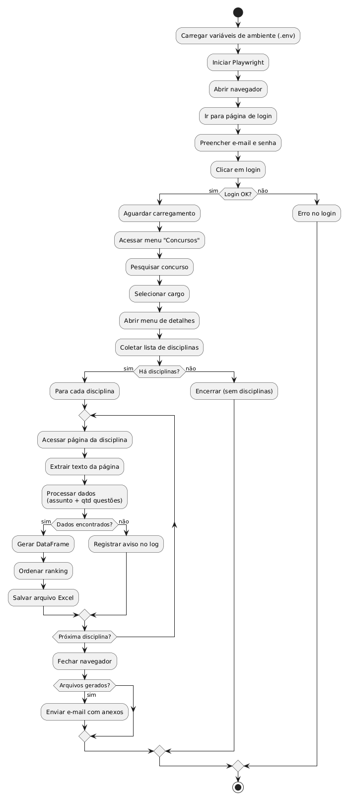

# Analisador Estratégico de Editais 

Robô desenvolvido em Python para extração de dados e análise de relevância de tópicos em editais de concursos e guias de estudo.

O foco principal é automatizar a identificação dos assuntos mais cobrados, otimizando o tempo de planejamento do estudante.

## Problema

Editais de concursos públicos, possuem centenas de tópicos. Identificar quais assuntos têm maior incidência de questões manualmente é um processo lento e sujeito a erros.

Este robô resolve a falta de dados estruturados em arquivos PDF.

## Funcionalidades

- Extração automatizada: lê arquivos PDF e identifica padrões de Assunto vs Quantidade de Questões.
- Filtro inteligente (Regex): ignora ruídos do PDF e captura apenas os tópicos numerados do conteúdo programático (ex: 1.1, 2.3.1).
- Exportação de dados: gera um arquivo Excel (.xlsx) para cada disciplina com o ranking completo.

## Tecnologias Utilizadas

- Python 3.x
- Pandas: manipulação e ordenação de dados.
- SMTP: para envio de emails.
- Plawrity: para automação web.
- PyPDF: extração de texto de arquivos PDF.
- BotCity Maestro SDK: integração para orquestração de robôs (RPA).
- Re (REGEX): para identificação de padrões.
- Pathlib: gerenciamento de caminhos de arquivos de forma multiplataforma.
- Dotenv: Para questões de segurança e boas práticas.

## Ferramentas Utilizadas

- Github: versionamento de código;
- Vscode: IDE;
- PlantUML: diagrama;

## Arquitetura do Projeto

### Fluxo de Execução



## Como Executar

1. Clone o repositório:

```bash
git clone https://github.com/seu-usuario/seu-repositorio.git
cd seu-repositorio
```

2. Instale as dependências:

```bash
pip install -r requirements.txt
```

3. Prepare o arquivo:

Coloque o PDF do edital na pasta resources.

4. Execute o robô:

```bash
python bot.py
```

## Resultados Gerados

Após a execução, o robô entrega:

- Arquivos .xlsx contendo os assuntos das disciplinas
- Email para o destinário com os respectivos arquivos em anexo